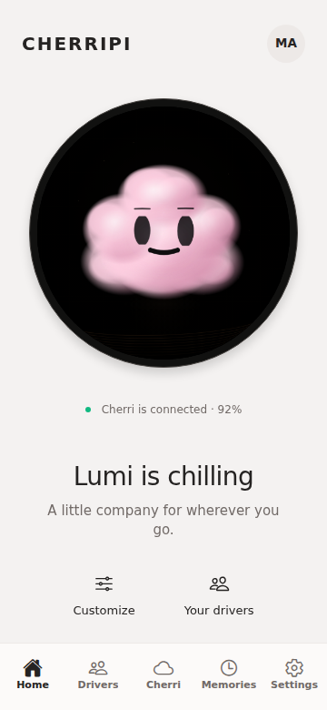
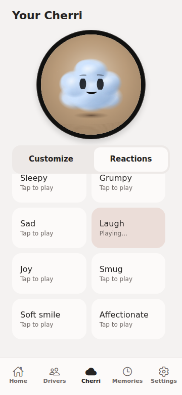
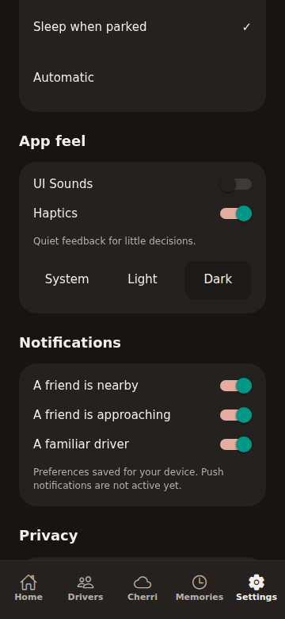

# CHERRIPI mobile V1

Implemented on `feat/cherripi-mobile-v1`. No merge performed. LCDPROTO is unchanged.

## Branch selection

| Repository | Branch | Commit | Decision |
| --- | --- | --- | --- |
| blob-mobile | feat/lcdproto-source-sync | d10baa1f87513d982369234f3abb57dfd75e8163 | Mobile base; includes source-sync work missing from main |
| blob-mobile | main | e2caa4c | Older initial prototype; not selected |
| LCDPROTO | feat/cloud-menu-ui-accents | 95dafb92b5ba87683294698bb7ea89729fd148d4 | Sole source revision for imported code and definitions |
| LCDPROTO | main / feat/character-system-v2 | bd2460fbc78c1d1e6dfe9cac4b362ddd887df6c3 | Compared latest shadow/turn fix with source branch counterpart dfe2ec0 |
| LCDPROTO | claude/lcdproto-controls-ui-redesign-tllu6w | 7303ff850aafd62c3d6a102ecdbc2efea17b664d | Compared console/theme work; source branch carries subsequent menu/preset/theme changes |

All remote branch heads and recent commit history were inspected before implementation. Older Cloud rig, eye-fix, LIGHTROOM, procedural-blob, simulator and project-polish branches were also reviewed in the history. The chosen source branch includes newer consumer-safe palettes and UI work as well as the turn/shadow fixes. Desktop console layout was not transplanted into mobile.

## Product and design

CHERRIPI is the product. Cherri is the character. Cloud remains an internal body/renderer name. App name, onboarding, primary screens, device copy, tabs, launcher icon and splash now use the product identity. Existing storage keys, app slug and URL scheme remain compatible.

Home centres the physical display, owner identity and human encounter language. Drivers supports search, nearby filtering, profile photos, a native share invitation, and explicit demo-driver addition. Memories displays dated social encounters without coordinates. Settings separates profile, device, sleep, feedback, appearance, notification preferences and privacy. Simulator and onboarding replay live under an explicit Developer disclosure.

One warm-neutral visual system spans light, dark and system appearance. Text contrast, native bottom safe areas, bounded desktop width, 48px touch controls and press feedback are shared. The black bezel is 9px around a round native 466-space display, with restrained depth. Customize pins this preview above scrollable controls so reaction feedback remains visible.

## Customization and reactions

Eight exact upstream palettes: Cloud White, Cloud Blue, Cool Mist, Purple Void, Emerald Vapor, Blush Rose, Golden Dawn and Baby Blue. The app exposes palette selection, Cherri name, brightness and three canonical scene modes: dark, warm and brown. Warm uses the authored sand/ripple scene. Legacy Sky profiles migrate to dark because Sky was not a supported upstream scene.

Saved looks preserve a named palette/environment pairing locally, with apply/remove controls and a limit of 20. Raw geometry and physics controls are excluded.

| Mobile reaction | Canonical ID |
| --- | --- |
| Happy | HAPPY |
| Excited | EXCITED_WIGGLE |
| Curious | CURIOUS_DOUBLE_TAKE |
| Surprised | SURPRISE_POP |
| Sleepy | SLEEPY_YAWN |
| Grumpy | ANGRY_FLARE |
| Sad | SAD_SETTLE |
| Laugh | LAUGH_SQUISH |
| Joy | JOY_HOP |
| Smug | SMUG |
| Soft smile | HAPPY_SOFT |
| Affectionate | AFFECTIONATE |

Reactions use canonical recipes, `recipeToBlobRig`, clips and `sampleClipAt`. Repeated taps restart the same clip. Reactions settle to the current state expression, preserving turn intent. Shy, wink, proud and confused were not invented as mobile-only clips: they are omitted from this initial curated core-recipe surface.

## Source integration

`vendor/lcdproto/manifest.json` records the pinned source SHA and SHA-256 for every copied file. Source files are unchanged. `scripts/sync-lcdproto.py` reads that revision from an adjacent LCDPROTO checkout. `scripts/build-runtime.cjs` compiles the browser runtime and extracts the pure scene/shadow code from the pinned React environment layer.

The mobile bridge now executes the actual upstream Cloud renderer, production face renderer and lobe physics rather than the earlier hand-transcribed versions. It retains mobile motion/drag orchestration, composes upstream performance beats, and uses the source floor-shadow model, cached sand scene and eight motes. A single character canvas and cached scene canvases share one animation loop. Rendering stops on tab blur or app background. Reduced motion removes automatic travel and performance body movement. Native rendering is capped to actual 466×466 pixels.

LCDPROTO defines eight product states and state accents. GOODBYE remains the existing mobile extension and uses a canonical soft smile. Earlier mobile state material overrides were not canonical; they were removed. State expression/performance IDs and surrounding UI accents carry the encounter state while the owner's palette is preserved.

## Feedback and persistence

Three original bundled WAV files total about 9KB: short selection tick, confirmation click and success tone. `expo-audio` preloads them at low volume. Sounds default off, haptics on. Audio is foreground-only, requests no microphone permission, and uses `playsInSilentMode: false`. Native Android/iOS audio and haptic behaviour still require device verification.

Profile, photos, theme, toggles, saved looks, device settings, drivers and memories use existing local storage services. Empty encounter history now survives restart. Pairing awaits simulated connection completion. Resetting proximity clears the active driver's nearby status. Service interfaces remain suitable for later replacement.

## Validation

- Lint and TypeScript: pass.
- Expo export: Android, iOS and web pass.
- Runtime test: all 12 reactions, finite canvas coordinates, settling frames, native resolution and stopped/resumed frame scheduling pass.
- Chromium browser: complete onboarding; all eight palettes/environments; profile photo selection; keyboard brightness persistence; saved look; repeated and interrupted reactions; light/dark; UI Sounds/haptic persistence; canonical simulator states; driver addition; memory creation; app restart; cleared memories remaining empty pass.
- Layout: 360×780 phone viewport plus 320, 393 and 1280px widths. No horizontal overflow. Preview/ring, Home, customization, reactions, Drivers, Memories and Settings visually inspected.
- React/design review: corrected ref handling, unnecessary icon-font bundles, low dark-theme text contrast, offscreen loops, invisible reaction preview and tab accessibility labels.
- Expo start reached Metro successfully in CI/offline mode. Interactive LAN discovery is unavailable in this container; web validation used exported app served locally in the browser test process.
- No physical Galaxy S22 or Android emulator was available. Native touch/keyboard, photo picker, silent-mode audio, haptic strength and sustained 60 FPS are not verified. Exports are not a substitute for those checks.

## Known limits

All device, driver and proximity services remain mocks. Invitations share text but cannot connect accounts. Sleep, privacy and notification settings are saved preferences rather than active hardware/backend integrations. No BLE, GPS, auth, backend, maps, payments, OTA or push implementation was added. The browser build is a client app (`web.output: single`), avoiding static-render hydration errors around native app APIs.

The imported renderer remains a prototype renderer. This pass does not claim pixel-for-pixel parity with the full desktop behaviour controller, every Performance Lab behaviour, or the separate foreground lighting pipeline. Launcher artwork is captured from the canonical mobile runtime.

## Reviewed screenshots

## Main files

- `src/app/(tabs)/`: Home, Drivers, Cherri, Memories, Settings and navigation.
- `src/app/onboarding.tsx`, `modal-add-driver.tsx`, `simulator.tsx`, `_layout.tsx`.
- `src/components/ui/Kit.tsx`, `src/constants/theme.ts`: shared surfaces, typography, touch controls, theme and reduced motion.
- `src/components/character/`: display bridge, canonical generated runtime/scene, swatches and environments.
- `src/components/common/SliderControl.tsx`, `src/components/home/narrative.ts`.
- `src/domain/`: canonical palette, scene, state and curated reaction adapters.
- `src/services/feedback/`, `src/services/storage/`, device/friend/encounter fixes, `src/store/AppContext.tsx`, `src/types/index.ts`.
- `vendor/lcdproto/`, `scripts/`, `assets/audio/`, `assets/branding/`, Expo/package/TypeScript configuration.
